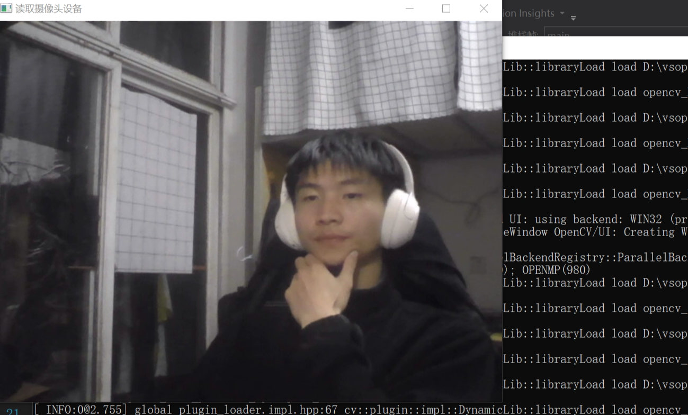

# 效果图


# OpenCV环境搭建

##  第一个OpenCV程序

- 下载opencvhttps://opencv.org/
- 配置环境变量D:\vsopencv\opencv\build\x64\vc16\bin
- 解决代码区域报错，添加包含目录和库目录


- 添加附加依赖项
- 

```cpp
#include<iostream>
#include<opencv2/opencv.hpp>
using namespace std;
using namespace cv;

int main(int argc,char*argv[])
{
    //加载图片
    Mat mypic = imread("dog.jpg");

    //显示窗口名称
    namedWindow("OpenCV测试程序");
    //显示一张图片
    imshow("OpenCV测试程序", mypic);

    //等待用戶按鍵
    waitKey(0);
    return 0;
}
```


#  OpenCV图像读写

imread（）函数功能：指定文件加载图像并且返回

在Window系统中，OpenCV的imread（）函数支持的图像类型

imshow（）函数功能：显示图像

imwrite（）函数功能：写入图像（输出图像到文件）

## 截取图像某个区域的方法

```cpp
#include<iostream>
#include<opencv2/opencv.hpp>
using namespace std;
using namespace cv;


int main()
{
	Mat mypic = imread("yingtao.png");

	Rect recta(256, 256, 250, 250);
	Rect rectb(224, 224, 250, 250);

	Mat rtest1;
	mypic(recta).copyTo(rtest1);//将图像区域，复制到rtest1
	imshow("图像1", rtest1);

	Mat rtest2;
	mypic(rectb).copyTo(rtest2);//将图像区域，复制到rtest2
	imshow("图像2", rtest1);

	Rect rectc = recta & rectb;//两个集合的交集
	Mat rtest3;
	mypic(rectc).copyTo(rtest3);//将图像区域，复制到rtest2
	imshow("图像3,交集", rtest3);

	Rect rectd(200, 200, 250, 250);
	rtest1.copyTo(mypic(rectd));//mypic(rectd)的部分区域
	imshow("rtest1粘贴到mypic", mypic);
	waitKey(0);
	return 0;
}
```


##  通过迭代器获取图像的像素

```cpp
#include<iostream>
#include<opencv2/opencv.hpp>
using namespace std;
using namespace cv;


void ModifyColoData(Mat&inputImages,Mat&outputImages,int pixel) {
	//通过迭代器获取图像的像素
	outputImages = inputImages.clone();
	//Vec3全部类型为：cv::Vec{2,3,4,6,8}{b,d,f,is,w}
	//2,3,4,6,8:表示列向量的长度
	//b,d,f,is,w表示类型，b-unchar类型，d-double类型，s-short类型
	Mat_<Vec3b>::iterator itstart = outputImages.begin<Vec3b>();
	Mat_<Vec3b>::iterator itend= outputImages.end<Vec3b>();

	for (; itstart != itend; itstart++) {
		(*itstart)[0] = (*itstart)[0] / pixel * pixel + pixel / 3;
		(*itstart)[1] = (*itstart)[1] / pixel * pixel + pixel / 3;
		(*itstart)[2] = (*itstart)[2] / pixel * pixel + pixel / 3;
	}
	imshow("目标函数效果", outputImages);
}

int main()
{
	Mat mypic = imread("yingtao.png");
	if (mypic.empty())return -1;
	imshow("原图像效果", mypic);

	Mat targetImages;
	targetImages.create(mypic.rows, mypic.cols, mypic.type());

	//调用自定义函数
	ModifyColoData(mypic, targetImages, 30);//数字越大越模糊

	waitKey(0);
	return 0;
}
```


#  视频读写

isOpened（）：判断读取摄像头是否成功

release（）：关闭已启动文件和摄像头

##  读取mp4视频文件

```cpp
#include<iostream>
#include<opencv2/opencv.hpp>
using namespace std;
using namespace cv;

int main()
{
	VideoCapture vcapture("video.mp4");
	Mat mframe;

	if (vcapture.isOpened()) {

		//直接从视频文件或设备捕获中抓取帧
		while (vcapture.grab())
		{
			vcapture >> mframe;//将视频中数据注入
			imshow("读取MP4视屏文件", mframe);
			waitKey(40);
		}
	}

	waitKey(0);
	return 0;
}
```

##  选取摄像头设备

```cpp
#include<iostream>
#include<opencv2/opencv.hpp>
using namespace std;
using namespace cv;

int main()
{
	VideoCapture vcapture;
	Mat mpic;

	vcapture.open(0);//表示使用我们电脑自带的摄像头
	if (!vcapture.isOpened())return -1;
	while (1) {
		vcapture >> mpic;
		imshow("读取摄像头设备", mpic);
		waitKey(40);
	}
	waitKey(0);
	return 0;
}
```



## 将摄像头录到的视频图像保存到工程目录

```cpp
#include<iostream>
#include<opencv2/opencv.hpp>
using namespace std;
using namespace cv;

int main()
{
	VideoCapture vcapture;
	Mat mpic;
	int ic = 0;

	vcapture.open(0);//表示使用我们电脑自带的摄像头
	if (!vcapture.isOpened())return -1;
	while (1) {
		vcapture >> mpic;
		imshow("读取摄像头设备", mpic);
		if (waitKey(20) == 32) {//我们用户按键：空格保存图片。20：表示延迟20ms
			string strname = to_string(ic) + ".jpg";//将照片jpg格式命名
			imwrite(strname, mpic);//将图像帧保存下来
			ic++;
		}
	}
	waitKey(0);
	return 0;
}
```


#  图像滤波技术

概念：尽量可能将图像细节特征保留下来，对目标图像的噪声进行抑制

目的：为图像识别抽取图像特征；消除图像中混入的噪声

要求：图像视觉效果应当更好；不能损坏图像轮廓和边缘

按空间滤波特性：分为线性滤波和非线性滤波。

基于OpenCV当中的五种滤波为：方框滤波、高斯滤波、均值滤波、双边滤波、中值滤波

线性滤波：方框滤波、高斯滤波、均值滤波。

非线性：双边滤波、中值滤波

高斯滤波是指高斯函数作为滤波函数的滤波操作；高斯模糊就是高斯低通滤波。


```cpp
#include<iostream>
#include<opencv2/opencv.hpp>
using namespace std;
using namespace cv;
void setSize(string s){
	cv::namedWindow(s, cv::WINDOW_NORMAL);
	resizeWindow( s,300, 300);
}
int main()
{
	
	setSize("原图像");
	setSize("方框滤波图像");
	setSize("高斯滤波图像");
	setSize("均值滤波图像");
	setSize("双边滤波图像");
	setSize("中值滤波图像");
	Mat target1, target2, target3, target4, target5;
	Mat MatSource = imread("fish.png");
	
	imshow("原图像", MatSource);

	//方框滤波
	boxFilter(MatSource, target1, MatSource.depth(), Size(2, 2), Point(-1, -1), false);
	imshow("方框滤波图像", target1);

	//高斯滤波
	GaussianBlur(MatSource, target2, Size(3, 3), 0, 0);
	imshow("高斯滤波图像", target2);

	//均值滤波
	blur(MatSource, target3, Size(6, 6));
	imshow("均值滤波图像", target3);

	//双边滤波
	bilateralFilter(MatSource, target4, 10, 10, 10);
	imshow("双边滤波图像", target4);

	//中值滤波
	medianBlur(MatSource, target5, 9);
	imshow("中值滤波图像", target5);
	waitKey(0);
	return 0;
}
```

## 方框滤波（boxFilter()函数）

parameters：src、dst、ddepth、dsize、anchor、nomalize、borderType

src：表示输入图像

dst：表示输出图像

ddepth：表示输出图像的深度，如果使用原图深度（-1）

dsize：滤波内核大小

anchor：表示锚点（平滑的那个点）

nomalize：默认为true，一个标识符，表示内核是否被气区域归一化

borderType：用于推断图像外部像素的某一种边界模式

## 高斯滤波（GaussianBlur（）函数）

src：待高斯滤波图像，图像可以具有任意的通道数目，但是数据类型必须为CV_8U，CV_16U，CV_16S，CV_32F或CV_64F。

dst：输出图像，与输入图像src具有相同的尺寸、通道数和数据类型。

ksize：高斯滤波器的尺寸，滤波器可以不为正方形，但是必须是正奇数。如果尺寸为0，则由标准偏差计算尺寸。

sigmaX：X方向的高斯滤波器标准偏差。

sigmaY：Y方向的高斯滤波器标准偏差; 如果输入量为0，则将其设置为等于sigmaX，如果两个轴的标准差均为0，则根据输入的高斯滤波器尺寸计算标准偏差。

borderType：像素外推法选择标志，，默认参数为BORDER_DEFAULT，表示不包含边界值倒序填充。

##  均值滤波（blur()函数）

src：表示输入图像

dst：表示输出图像

ksize：内核大小,一般使用Size（w,h）

anchor：表示被平滑的点，默认值Point（-1，-1）

borderType：用于推断图像外部像素的某一种边界模式

## 双边滤波（bilateralFilter（））

src：表示输入图像

dst：表示输出图像

d：表示早过滤的过程中每个像素领域的直径范围

sigmaColor：表示颜色空间过滤器的值

sigmaSpace：坐标空间中滤波器的值

borderType：用于推断图像外部像素的某一种边界模式

## 中值滤波（medianBlur（））

src：表示输入图像

dst：表示输出图像

ksize：孔径线性尺寸，该参数必须是大于1的奇数

# 人脸检测

```cpp
#include<iostream>
#include<opencv2/opencv.hpp>
using namespace std;
using namespace cv;


int main(int argc, char* argv[])
{
   
    CascadeClassifier clsface;
    string strFileFace = "D:\\vsopencv\\opencv\\sources\\data\\haarcascades\\haarcascade_frontalface_alt.xml";
    if (!clsface.load(strFileFace)) {
        cout << "加载haarcascade_frontalface_alt.xml 失败";
        return -1;
    }
    Mat mSrcImage, mDstImage,mGrayImage;

    mSrcImage = imread("10p.png");

    //将其复制
    mDstImage = mSrcImage.clone();

    //将图像生成灰度，目的提高检测效率
    cvtColor(mSrcImage, mGrayImage, COLOR_BGR2BGRA);

    //实现人脸检测
    vector<Rect>vFaceRect;
    clsface.detectMultiScale(mGrayImage, vFaceRect, 1.1, 3, 0);
    cout << "【目前已经检测出人脸个数】：" << vFaceRect.size() << endl << endl;
    if (vFaceRect.size()) {
        for (int i = 0; i < vFaceRect.size(); i++) {
            //在人脸上，标注矩形
            rectangle(mDstImage, vFaceRect[i], Scalar(0, 0, 255), 1);
        }
    }

    imwrite("newFacedetectionFile.png", mDstImage);

    imshow("人脸检测", mDstImage);
    waitKey(0);
    return 0;
}
```


#  视频录制技术

```cpp
#include<opencv2/videoio.hpp>
#include<iostream>
#include<opencv2/opencv.hpp>
#include<opencv2/videoio.hpp>
using namespace std;
using namespace cv;
void setSize(string s){
	cv::namedWindow(s, cv::WINDOW_NORMAL);
	resizeWindow( s,300, 300);
}
int main()
{
	setSize("显示视图图像");
	VideoCapture vcap("video.mp4");
	
	//获取视频中帧的宽高
	int fvwidth = vcap.get(CAP_PROP_FRAME_WIDTH);
	int fvheight = vcap.get(CAP_PROP_FRAME_HEIGHT);
	//获取帧数
	double fvfps = vcap.get(CAP_PROP_FPS);

	//录制MP4视频
	VideoWriter vw("e:/xhu/writermp4.mp4", vcap.get(CAP_PROP_FOURCC), fvfps, Size(fvwidth, fvheight),true);

	Mat fm;
	while (true) {
		vcap.read(fm);//fm为输出，read将捕获的视屏一帧一帧的传输进fm

		if (fm.empty())break;
		vw.write(fm);
		imshow("显示视图图像", fm);
		int key = waitKey(1);
		if (key == 27)break;
	}
	vcap.release();
	vw.release();

	waitKey(0);
	return 0;
}
```


#  边缘检测技术

在检测物体边缘的时候，首先对轮廓进行粗略检测，然后在通过连接规则将原来检测到的轮廓点链接起来同时也检测和连接漏掉的边界点以及去除虚假的边界

步骤：图像滤波—>图像增强->图像检测->图像定位

```cpp
#include<iostream>
#include<opencv2/opencv.hpp>

using namespace std;
using namespace cv;

void setSize(string s) {
    cv::namedWindow(s, cv::WINDOW_NORMAL);
    resizeWindow(s, 300, 300);
}

int main() {
    setSize("原图像");
    setSize("X方向梯度");
    setSize("Y方向梯度");
    setSize("XY方向梯度相加");
    Mat mSrc = imread("yingtao.png");
    imshow("原图像",mSrc);

    Mat mSox, mAbsx,mSoy,mAbsy,mResult;

    //X方向梯度
    Sobel(mSrc, mSox, CV_16S, 1, 0, 3, 1, 1, BORDER_DEFAULT);//计算图像灰度的近似度
    convertScaleAbs(mSox, mAbsx);
    imshow("X方向梯度", mAbsx);
  
    //Y方向梯度
    Sobel(mSrc, mSoy,CV_16S, 0, 1, 3,1, 1, BORDER_DEFAULT);//计算图像灰度的近似度
    convertScaleAbs(mSoy, mAbsy);
    imshow("Y方向梯度", mAbsy);

    //X+Y（梯度相加)
    addWeighted(mAbsx, 0.6, mAbsy, 0.6, 0, mResult);
    imshow("XY方向梯度相加", mResult);

    waitKey(0);
    return 0;
}
```

