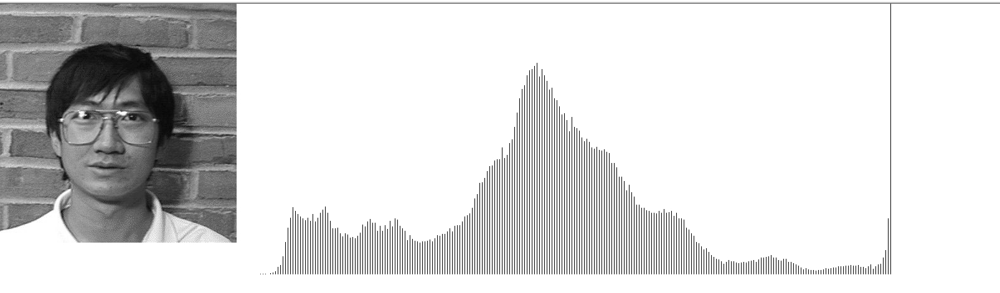

# 直方图计算

计算相同灰度级的像素点个数

```C++
void CMFCApplication1View::histCompute(BYTE*image, int width, int height)
{
	//计算直方图
	int n;
	for (n = 0; n < 256; n++)
		hist[n] = 0;
	int i, j;
	BYTE gray;
	for (i = 0; i < height; i++) {
		for (j = 0; j < width; j++) {
			gray = image[i * width + j];
			hist[gray]++;
		}
	}
}
```


