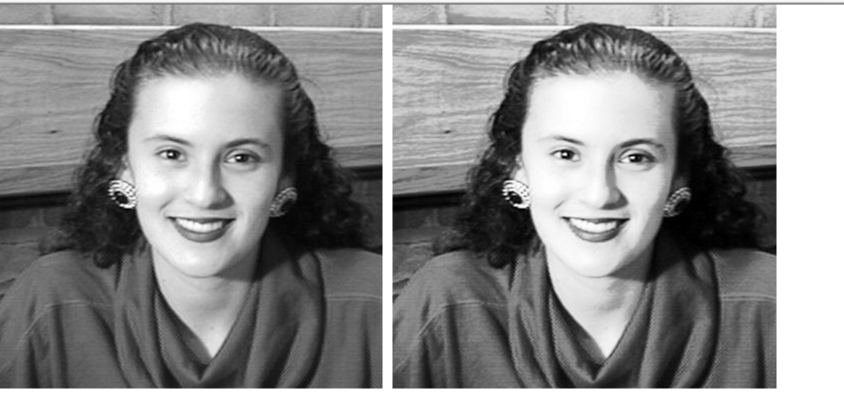
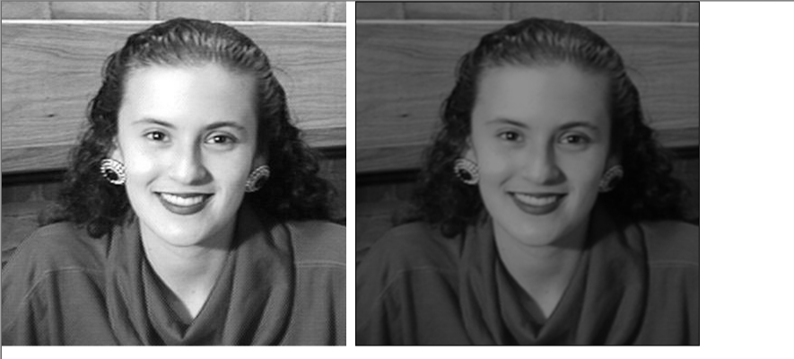
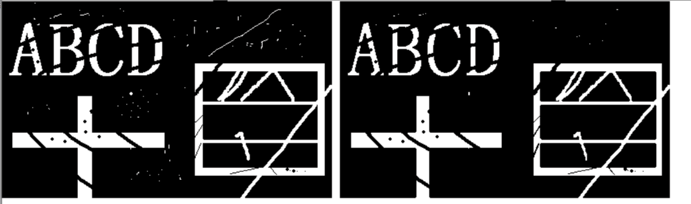

# 直方图计算

计算相同灰度级的像素点个数

```C++
void CMFCApplication1View::histCompute(BYTE*image, int width, int height)
{
	//计算直方图
	int n;
	for (n = 0; n < 256; n++)
		hist[n] = 0;
	int i, j;
	BYTE gray;
	for (i = 0; i < height; i++) {
		for (j = 0; j < width; j++) {
			gray = image[i * width + j];
			hist[gray]++;
		}
	}
}
```


# 直方图均衡

```C++
void CMFCApplication1View::hisEqualiz(BYTE* image, int w, int h, BYTE* outImg)
{
	int his[256];
	int n, i, j;
	//计算图像直方图
	for (n = 0; n < 256; n++) {
		his[n] = 0;
	}
	for (i = 0; i < h; i++) {
		for (j = 0; j < w; j++) {
			his[image[i * w + j]] ++;
		}
	}
	//计算新的灰度级
	for (n = 1; n < 256; n++)
		his[n] += his[n - 1];
	BYTE gray[256];
	float cons;
	cons = 255.0 / his[255];
	for (n = 0; n < 256; n++) {
		gray[n] = (BYTE)(cons * his[n]);
	}
	//用新的灰度级替换原来的灰度级
	for (i = 0; i < h; i++)
		for (j = 0; j < w; j++)
			outImg[i * w + j] = gray[image[i * w + j]];
}
```



# 均值滤波

```C++

//均值滤波
void CMFCApplication1View::meanFilter(BYTE* image, int width, int heigth, BYTE* outImg)
{
	int smth[9];
	int i, j, m, n;
	BYTE block[9];

	int value;
	for (i = 0; i < 9; i++)
		smth[i] = 1;
	for (i = 0; i < height; i++) {
		for (j = 0; j < width; j++) {
			if (i == 0 || j == 0 || i == height - 1 || j == width - 1)
				outImg[i * width + j] = 0;
			else {
				for (m = -1; m < 2; m++)
					for (n = -1; n < 2; n++)
						block[(m + 1) * 3 + n + 1] = image[(i + m) * width + j + n];

				value = convolution(smth, block);
				outImg[i * width + j] = BYTE(value / 9);
			}
		}
	}
}


int CMFCApplication1View::convolution(int* operatr, BYTE* block)
{
	int value;
	int i, j;
	value = 0;
	//卷积运算
	for (i = 0; i < 3; i++)
		for (j = 0; j < 3; j++)
			value += operatr[i * 3 + j] * block[i * 3 + j];
	return value;

}
```


# 高斯滤波

```C++
int CMFCApplication1View::convolution(int* operatr, BYTE* block)
{
	int value;
	int i, j;
	value = 0;
	//卷积运算
	for (i = 0; i < 3; i++)
		for (j = 0; j < 3; j++)
			value += operatr[i * 3 + j] * block[i * 3 + j];
	return value;

}

void CMFCApplication1View::gaussian(BYTE* image, int width, int heigth, BYTE* outImg)
{
	//高斯滤波
	int smth[9];
	int i, j, m, n;
	BYTE block[9];

	smth[0] = 1;smth[4] = 4;
	smth[1] = 2;smth[5] = 2;
	smth[2] = 1;smth[6] = 1;
	smth[3] = 2;smth[7] = 2;
				smth[8] = 1;
	int value;
	for (i = 0; i < 9; i++)
		smth[i] = 1;
	for (i = 0; i < height; i++) {
		for (j = 0; j < width; j++) {
			if (i == 0 || j == 0 || i == height - 1 || j == width - 1)
				outImg[i * width + j] = 0;
			else {
				for (m = -1; m < 2; m++)
					for (n = -1; n < 2; n++)
						block[(m + 1) * 3 + n + 1] = image[(i + m) * width + j + n];

				value = convolution(smth, block);
				outImg[i * width + j] = BYTE(value / 16);
			}
		}
	}
}
```



# 中值滤波

```C++
void CMFCApplication1View::midFindFiltering(BYTE* image, int width, int heigth, BYTE* outImg)
{
	//中值滤波
	int i, j, m, n;
	BYTE block[9];

	int value;
	int blockNum = 9;
	for(i=0;i<height;i++)
		for (j = 0; j < width; j++) {
			if (i == 0 || j == 0 || i == width - 1 || j == height - 1)
				outImg[i * width + j] = 0;
			else {
				for (m = -1; m < 2; m++)
					for (n = -1; n < 2; n++)
						block[(m + 1) * 3 + n + 1] = image[(i + m) * width + j + n];

				value = MidValueFind(blockNum, block);
				outImg[i * width + j] = value;
			}
		}
}

int CMFCApplication1View::MidValueFind(int num, BYTE* d)
{
	int value;

	int i, j;
	int temp;
	for (i = 0; i < num - 1; i++)
		for (j = i + 1; j < num; j++)
		{
			if (d[i] < d[j])
			{
				temp = d[i];
				d[i] = d[j];
				d[j] = temp;
			}
		}
	return d[num / 2];

}

```


# 图像边缘提取

```C++
void CMFCApplication1View::sobel(BYTE* window, int wid, int hei, int* sob_x, int* sob_y)
{
	int so_x[9];//horizontal
	so_x[0] = -1;
	so_x[1] = 0;
	so_x[2] = 1;
	so_x[3] = -2;
	so_x[4] = 0;
	so_x[5] = 2;
	so_x[6] = -1;
	so_x[7] = 0;
	so_x[8] = 1;

	int so_y[9];
	so_y[0] = -1;
	so_y[1] = -2;
	so_y[2] = -1;
	so_y[3] = 0;
	so_y[4] = 0;
	so_y[5] = 0;
	so_y[6] = 1;
	so_y[7] = 2;
	so_y[8] = 1;

	int i, j, m, n;
	BYTE block[9];

	//求图像边缘
	int value;
	for(i=0;i<hei;i++)
		for (j = 0; j < wid; j++) {
			if (i == 0 || j == 0 || i == hei - 1 || j == wid - 1) {
				sob_x[i * wid + j] = 0;
				sob_y[i * wid + j] = 0;
			}
			else {
				for (m = -1; m < 2; m++)
					for (n = -1; n < 2; n++)
						block[(m + 1) * 3 + n + 1] = window[(i + m) * wid + j + n];
				value = convolution(so_x, block);
				sob_x[i * wid + j] = value;

				value = convolution(so_y, block);
				sob_y[i * wid + j] = value;
			}
		}

}

```


# 腐蚀与膨胀

```C++
void CMFCApplication1View::erosion(BYTE* image, int w, int h, BYTE* outImg)
{
	int rept;
	memcpy(outImg, image, sizeof(BYTE) * width * height);
	//腐蚀
	int i, j;
	int m, n;
	BYTE flag;
	for (rept = 0; rept < 3; rept++) {
		for (i = 1; i < h - 1; i++) {
			for (j = 1; j < w - 1; j++) {
				if (image[i * w + j] == 255) {//找到第一个图形点
					flag = 0;
					for (m = -1; m < 2; m++) {
						for (n = -1; n < 2; n++) {
							if (image[(i + m) * w + j + n] == 0) {
								flag++;//3*3领域包含多个背景点
								break;
							}
						}
					}
					if (flag > 2)
						outImg[i * w + j] = 0;//则该图形点设为背景点
				}
			}
		}
	}
	memcpy(image, outImg, sizeof(BYTE) * width * height);
}

void CMFCApplication1View::dilation(BYTE* image, int w, int h, BYTE* outImg)
{
	int rept;
	//膨胀
	memcpy(outImg, image, sizeof(BYTE) * width * height);
	int i, j;
	int m, n;
	BYTE flag;
	for (rept = 0; rept < 3; rept++) {
		for (i = 1; i < h - 1; i++) {
			for (j = 1; j < w - 1; j++) {
				if (image[i * w + j] == 0) {//找到第一个图形背景点
					flag = 0;
					for (m = -1; m < 2; m++) {
						for (n = -1; n < 2; n++) {
							if (image[(i + m) * w + j + n] == 255) {
								flag++;
							}
						}
						if (flag > 1)//领域包含2个或者2个以上的图形点
							outImg[i * w + j] = 255;//则该图形点设为图形点
					}
				}
			}
		}
		memcpy(image, outImg, sizeof(BYTE) * width * height);
	}
}
```




